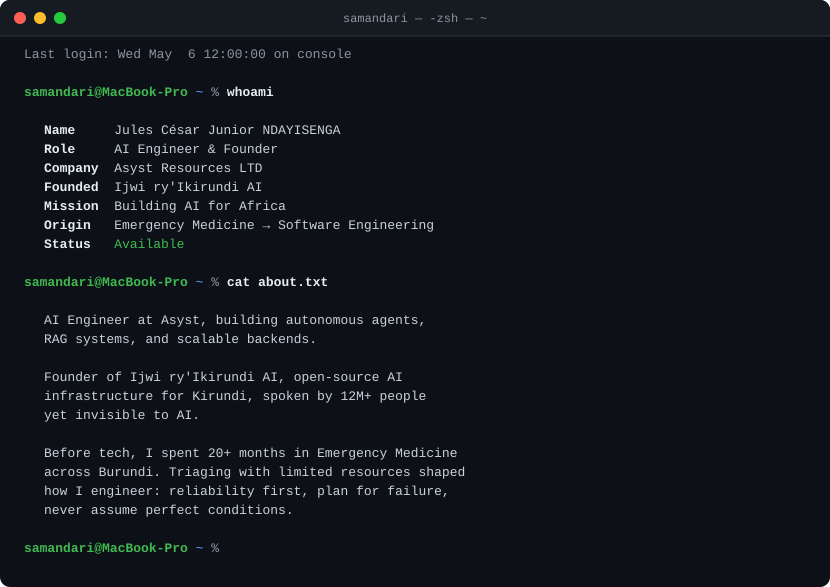
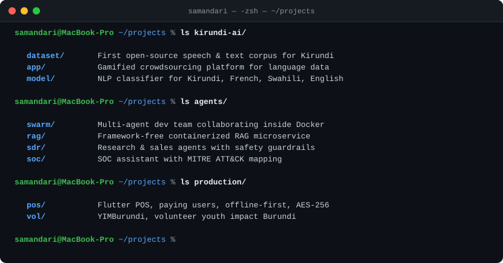
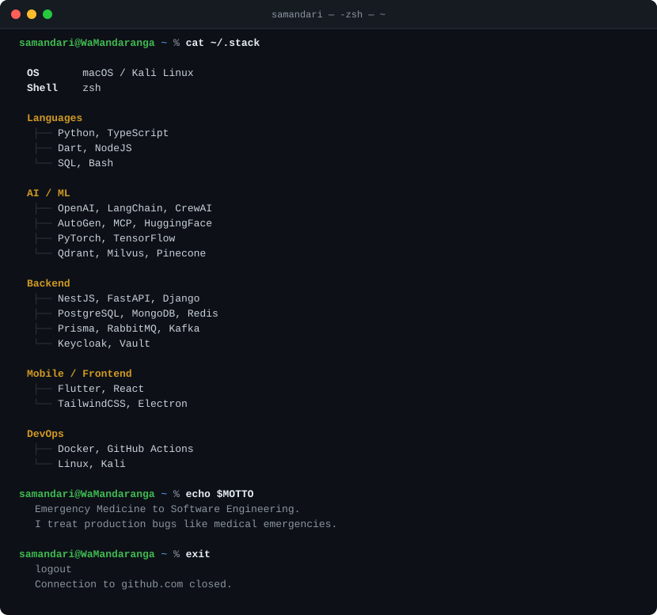

<picture></picture>

<picture></picture>

clickable links

 

- [Kirundi Dataset](https://github.com/Ijwi-ry-Ikirundi-AI/Kirundi_Dataset) · [Contribution App](https://www.samandari.dev/kirundi-contribution-app/) · [Lang Identifier](https://huggingface.co/spaces/samandari/burundi-lang-id)
- [Dev Swarm](https://github.com/Sama-ndari/dev-swarm-autonomous-agency) · [Enterprise RAG](https://github.com/Sama-ndari/enterprise-rag-chatbot) · [Autonomous SDR](https://github.com/Sama-ndari/autonomous-sdr-agent) · [SentinelAI](https://github.com/Sama-ndari/sentinelai-soc-assistant)
- [E-Sama POS](https://apps.samandari.dev/app.html?id=esama) · [YIMBurundi](https://www.yimburundi.com)

<picture></picture>

 

<picture>
  <source media="(prefers-color-scheme: dark)" srcset="https://github-readme-stats.vercel.app/api?username=Sama-ndari&show_icons=true&count_private=true&include_all_commits=true&theme=github_dark&hide_border=true&bg_color=0d1117" />
  
</picture>
<picture>
  <source media="(prefers-color-scheme: dark)" srcset="https://streak-stats.demolab.com?user=Sama-ndari&theme=github-dark-blue&hide_border=true&background=0d1117" />
  
</picture>

 

<picture>
  <source media="(prefers-color-scheme: dark)" srcset="https://github-readme-activity-graph.vercel.app/graph?username=Sama-ndari&theme=github-compact&hide_border=true&area=true&bg_color=0d1117&color=58a6ff&line=58a6ff&point=58a6ff" />
  
</picture>

 

<picture>
  <source media="(prefers-color-scheme: dark)" srcset="https://raw.githubusercontent.com/Sama-ndari/Sama-ndari/output/github-snake-dark.svg" />
  
</picture>

